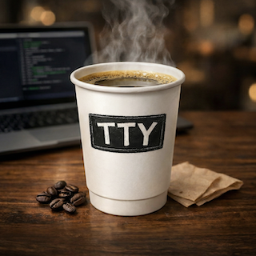

# Ventty

<p align="center">
  
</p>

<h1 align="center">ventty</h1>

<p align="center">
  A modern C++20 terminal UI library for building interactive text-based applications.
</p>

---

## Overview

**ventty** is a cell-based terminal abstraction library that provides high-level building blocks for creating TUI (Text User Interface) and graphical terminal applications. It features diff-based rendering, overlapping window management, full Unicode/UTF-8 support, 24-bit true color, and a widget toolkit. Two backends are available: ANSI/VT100 for real terminals and SDL3 for graphical windows.

## Features

- **Cell-based rendering** -- The terminal is modeled as a 2D grid of styled cells, enabling precise control over every character
- **Diff-based updates** -- Only changed cells are re-rendered, minimizing I/O for smooth performance
- **Window management** -- Overlapping windows with Z-ordering, scrollback buffers, and visibility control
- **Full Unicode & CJK support** -- Proper UTF-8 encoding/decoding and fullwidth character handling
- **24-bit true color** -- RGB, xterm256, and CGA 16-color palettes with color interpolation
- **Input handling** -- Keyboard (with modifiers), mouse events, and terminal resize detection
- **Widget toolkit** -- Label, ListView, Dialog, InputDialog, Menu/MenuBar widgets
- **ASCII art toolkit** -- Box drawing, spinners, progress bars, bar graphs, and braille plotting
- **Dual backends** -- ANSI terminal (`ventty::Terminal`) and SDL3 graphical window (`ventty::GfxTerminal`)

## Requirements

- CMake >= 4.0
- C++20 compiler
- POSIX-compliant system (Linux, macOS, BSD)
- SDL3, SDL3_image (for graphical backend, optional)

## Build

```bash
cmake -S . -B build
cmake --build build
```

Graphics support can be disabled with `-DVENTTY_BUILD_GFX=OFF`.

## Quick Start

```cpp
#include <ventty/ventty.h>

int main()
{
    ventty::Terminal term;
    if (!term.init()) return 1;

    term.onKey([&](ventty::KeyEvent const & ev)
    {
        if (ev.key == ventty::KeyEvent::Key::Escape)
            term.quit();
    });

    auto * win = term.createWindow(2, 1, 40, 10);
    ventty::Style style{ventty::Color(0, 255, 128), ventty::Color(0, 0, 0)};
    win->drawText(1, 1, "Hello, ventty!", style);

    while (term.isRunning())
    {
        while (term.pollEvent()) ;
        term.render();
        std::this_thread::sleep_for(std::chrono::milliseconds(33));
    }

    term.shutdown();
    return 0;
}
```

## Project Structure

```
ventty/
├── src/ventty/
│   ├── ventty.h              # Single-include header (terminal backend)
│   ├── ventty_gfx.h          # Single-include header (graphical backend)
│   ├── core/                 # Cell, Color, Style, Rect, UTF-8, Window
│   ├── terminal/             # TerminalBase, Terminal (ANSI), Renderer, Input
│   ├── gfx/                  # GfxTerminal (SDL3), GfxRenderer, GfxFont, GfxInput
│   ├── art/                  # ASCII art & UI elements
│   └── widget/               # Label, ListView, Dialog, InputDialog, Menu
├── examples/
│   ├── mdir/                 # MDIR clone -- terminal file manager
│   └── RogueLike/            # Dice-n-Destiny -- roguelike game (SDL3)
├── tests/                    # Unit tests & interactive demos
├── tools/                    # Font atlas generator, build scripts
└── docs/                     # Design plans & assets
```

## Architecture

| Layer | Description |
|-------|-------------|
| **Core** | `Cell`, `Color`, `Style`, `Rect`, `Utf8`, `Window` -- fundamental types and 2D cell buffers with drawing primitives |
| **Terminal** | `TerminalBase` (abstract), `Terminal` (ANSI/VT100) -- backend-agnostic interface with POSIX implementation |
| **Gfx** | `GfxTerminal`, `GfxRenderer`, `GfxFont`, `GfxInput` -- SDL3 graphical backend with bitmap font atlas rendering |
| **Widget** | `Label`, `ListView`, `Dialog`, `InputDialog`, `Menu`, `MenuBar` -- reusable UI components |
| **Art** | `AsciiArt` -- box drawing, spinners, progress bars, braille plotting |

The library is designed to be backend-agnostic. Both `Terminal` (ANSI/VT100) and `GfxTerminal` (SDL3) implement the common `TerminalBase` interface, allowing widgets and application code to work with either backend.

## Examples

- **[mdir](examples/mdir/)** -- MDIR clone, a terminal-based file manager inspired by the classic Korean DOS shell
- **[RogueLike](examples/RogueLike/)** -- Dice-n-Destiny, a Brogue-inspired Korean roguelike game using the SDL3 backend

## License

See [LICENSE](LICENSE) for details.
